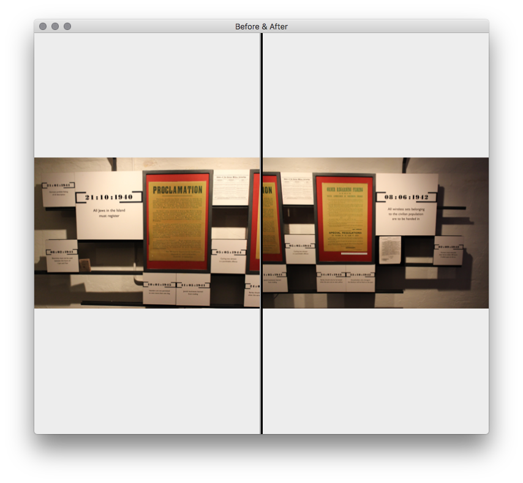

###Project Image diff

Compare 2 images (a simple before and after for picking images after post processing)

- [x] side by side
- [x] up & down
- [ ] zoom (synchronized)
- [ ] overlay
	- [ ] horizontal
	- [ ] vertical
	- [ ] adjustable

More than 2 consider as Album?
	- [ ] Choose 1 and cycle through rest?

###Update

* [Download](https://goo.gl/WIZrWF) - Basic usable version
* **Usage**: Drop two images to dock icon

####Links

http://stackoverflow.com/questions/2489961/dropping-files-onto-dock-icon-in-cocoa

---
2016-12-05

